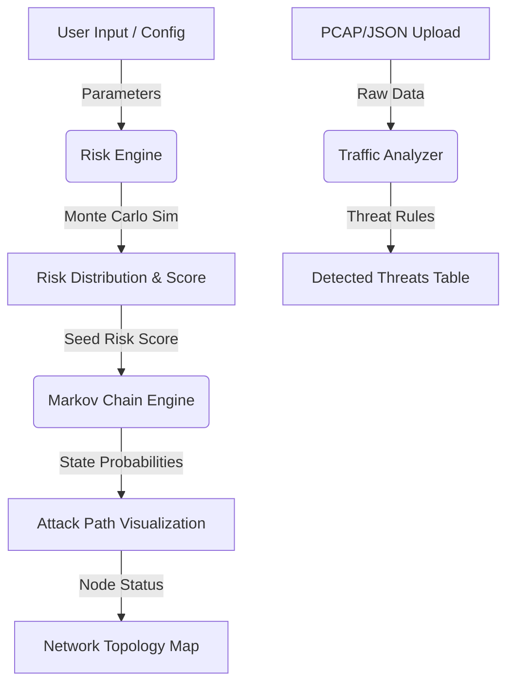

# Stochastic ICS/OT Risk Assessment Framework


## Abstract

The **Stochastic ICS/OT Risk Assessment Framework** is an advanced engineering tool designed to quantify and visualize cybersecurity risks in Industrial Control Systems (ICS). Unlike traditional static risk assessment models, this framework employs a hybrid probabilistic approach. It combines **Monte Carlo simulations** (utilizing the Box-Muller transform) to estimate residual risk distributions and **Discrete Time Markov Chains (DTMC)** to predict the temporal probability of attack progression from reconnaissance to full system compromise. The system further integrates real-time traffic analysis capabilities, allowing for the ingestion of captured packet data to detect specific industrial protocol anomalies (e.g., Modbus Function Code 5 exploits).

---

## Key Features

### 1. Probabilistic Attack Modeling (Markov Engine)
The core predictive engine utilizes a discrete-time state transition matrix to forecast the security state of the network over a 24-hour horizon.
-   **Methodology**: A 4-state Markov Chain (`Secure` → `Reconnaissance` → `Exploitation` → `Compromised`).
-   **Logic**: Transition probabilities are dynamically weighted by the calculated Risk Score. A higher risk score increases the likelihood of forward state transitions (e.g., `P(Recon → Exploitation)`).
-   **Output**: A time-series probability curve visualizing the "Time-to-Compromise".

### 2. Hybrid Analysis & Ingestion
Bridging the gap between simulation and reality, the framework includes a client-side packet ingestion engine (`TraficAnalyzer`).
-   **Capability**: Parses JSON-formatted network packet logs directly in the browser.
-   **Detection Rules**:
    -   **Modbus TCP Anomalies**: Flags unauthorized Write Coil commands (FC 5, 15).
    -   **Port Scanning**: Identifies source IPs connecting to >10 unique ports within a distinct time window.

### 3. Dynamic Network Topology
A graph-theory-based visualization of the industrial network architecture.
-   **Visualization**: Renders nodes (PLCs, HMIs, Firewalls) and edges (Network Links) using Scalable Vector Graphics (SVG).
-   **Interactivity**: The graph is tightly coupled with the Markov Engine. As the simulation predicts a high probability of compromise, critical nodes (e.g., Siemens S7-1500 PLC) dynamically shift state colors (Green → Red) and attack paths are highlighted, providing immediate visual situational awareness.

---

## System Architecture

The application follows a modular, client-side architecture optimized for performance and privacy.



## Installation & Usage

This project is built with **Next.js** and **TypeScript**. Ensure you have Node.js (v18+) installed.

1.  **Clone the repository**:
    ```bash
    git clone https://github.com/usaaaaasdc/ics-risk-framework.git
    cd ics-risk-framework
    ```

2.  **Install dependencies**:
    ```bash
    npm install
    # or
    yarn install
    ```

3.  **Run the development server**:
    ```bash
    npm run dev
    ```

4.  **Access the application**:
    Open [http://localhost:3000](http://localhost:3000) in your browser.

## Disclaimer

This software is a **research prototype** developed for educational and academic purposes. It simulates industrial protocols and attack vectors for risk assessment and analysis. It is **not** intended for use in production safety-critical systems without further validation. All analysis is performed client-side; no sensitive data is transmitted to external servers.

---

**Author**: Osama Ali
**License**: MIT
